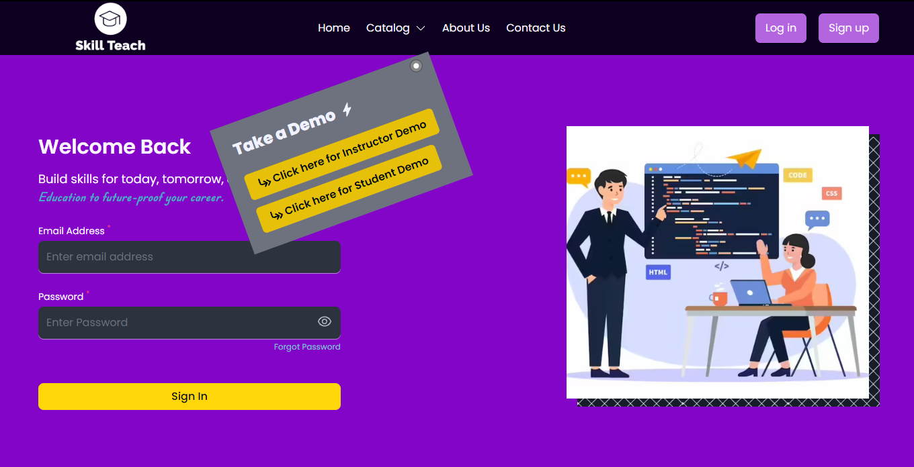
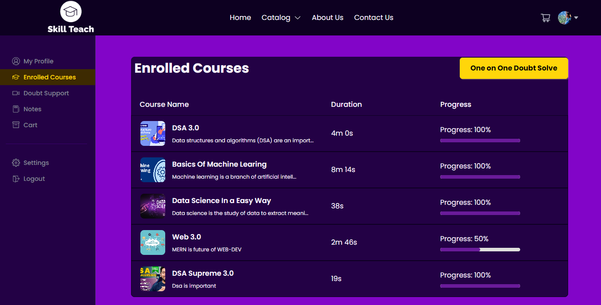
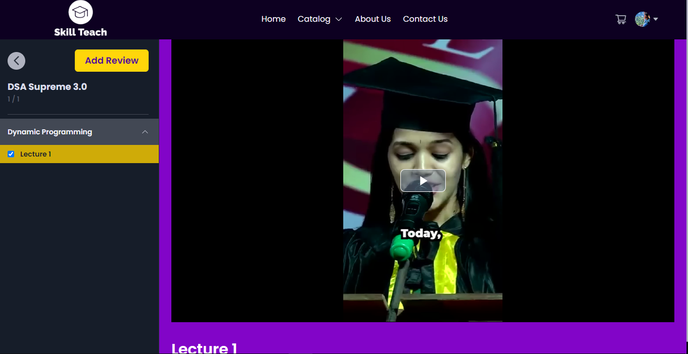
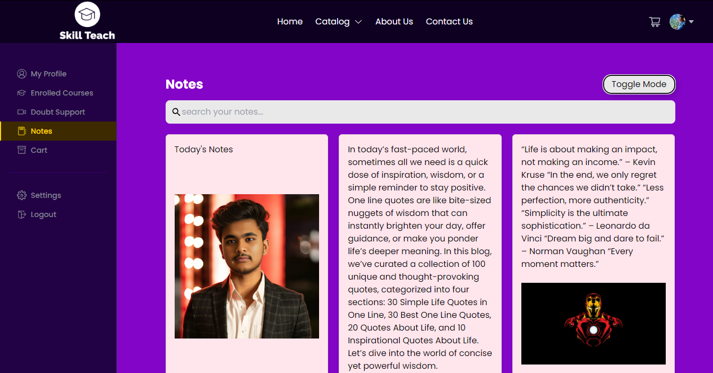
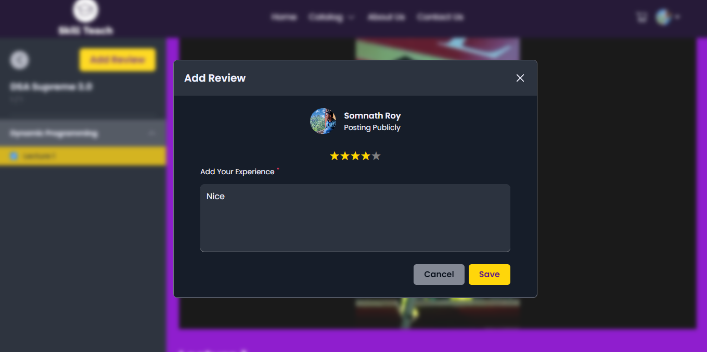
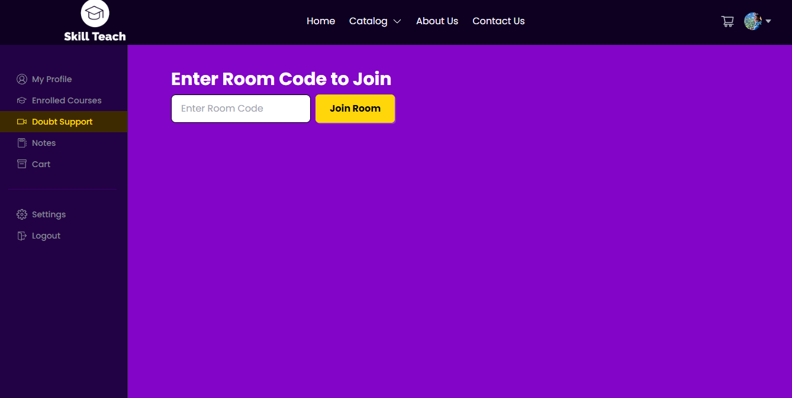
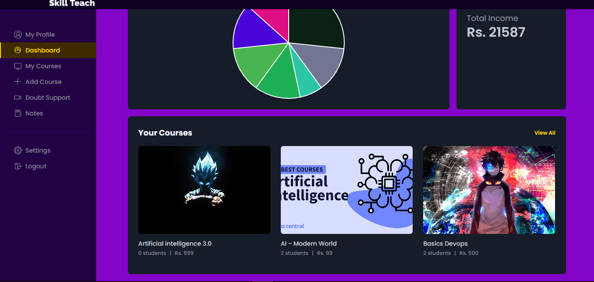
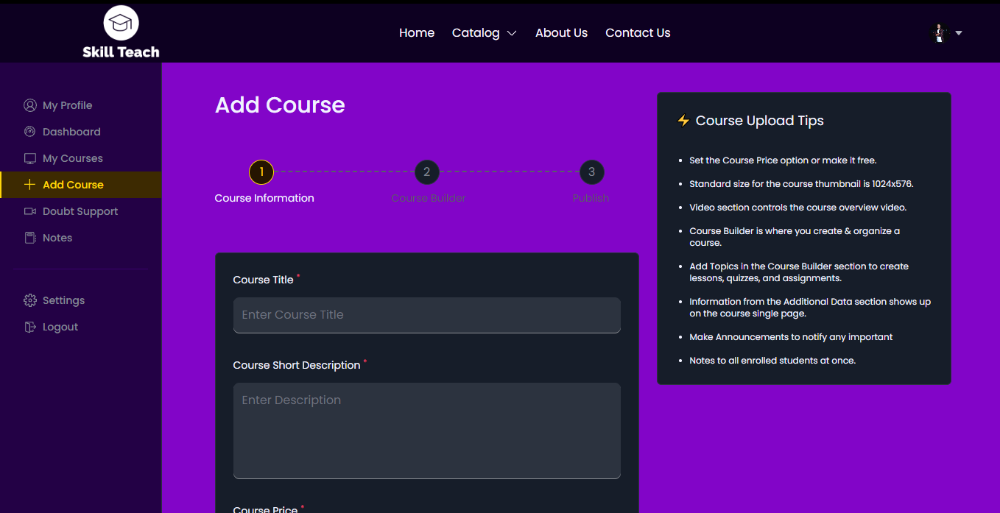
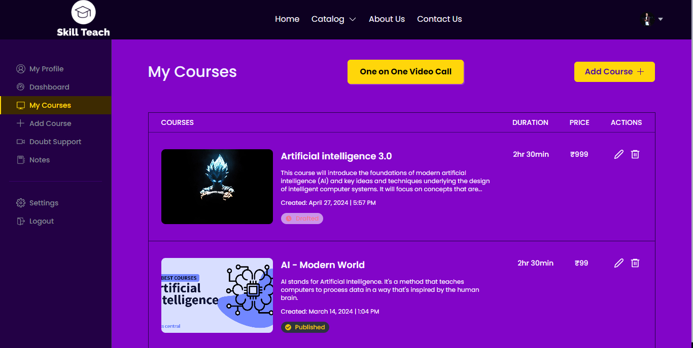

# Skill Tech - An Edtech Platform

Skill Teach is a fully functional ed-tech platform where users can log in as students or instructors. Instructors can create and publish courses, and students can consume and rate educational content.

## 🛠 Skills

MongoDB, Express.js, Node.js, React.js, Tailwind-CSS,
MVC, JWT, Redux toolkit

## Tech Stack

**Client :** React, Redux, TailwindCSS

**Server :** Node, Express

## Installation

1.  Clone the repository :

```bash
   git clone https://github.com/SomnathRoy-JU25/Skill_Teach_Final.git
```

2. Back-end Setup :

```bash
   cd server
   npm install express
```

3. Front-end Setup

```bash
   npm install
```

4. Setup .env file

### Running the Application

1. Run the following command to start the application:

```bash
   npm run dev
```

## Documentation of PostmanAPI for API Testing

The following endpoints are available for testing the Skill Teach.

### [Click here to view Postman API Documentation](https://documenter.getpostman.com/view/29700625/2sA2rCV2oz)

## User Interfaces













